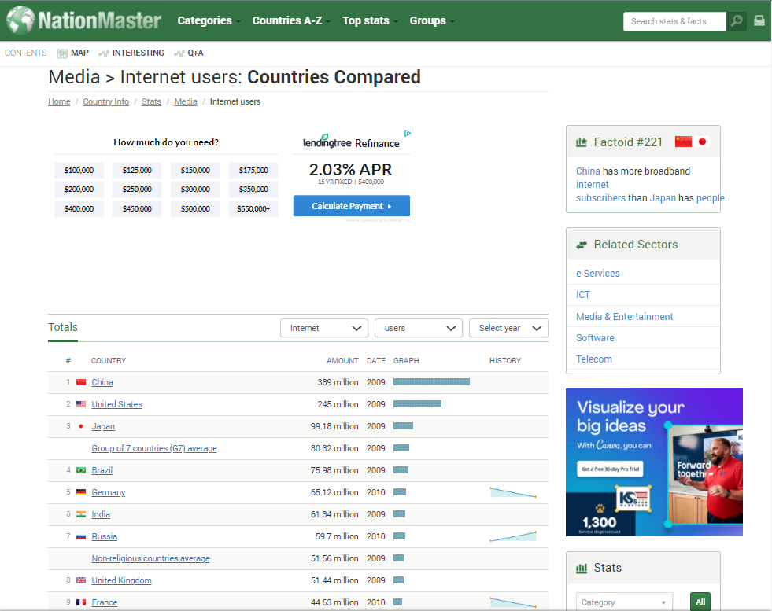

[Insert text on what to expect and what is requests (a user-friendly web package)]

To work through the examples below, we first need to load requests:

~~~
import pandas as pd
import requests
~~~
{: .language-python}

# Getting Data from a Webpage

First, download a web page. Here, we are using the website [NationMaster.com](https://www.nationmaster.com/country-info/stats/Media/Internet-users) to get the counts of internet users per country. This example is good because the raw data is potentially very useful for further computation. The page is larded with graphics and ads and whatnot, so simply copy/pasting is not likely to work here.

~~~
page = requests.get("https://www.nationmaster.com/country-info/stats/Media/Internet-users")

# N.B.: page content is also cached locally:
# page_content = open("scraping-example-cached.html", mode="rb").read()
~~~
{: .language-python}

`page` is an object that can be examined. Recall how we can check the type of the object.

~~~
type(page)
~~~
{: .language-python}

~~~
requests.models.Response
~~~
{: .output}

We are also able to check the status of `page`. A status result of `200` indicates that it is good to continue.

~~~
page.status_code
~~~
{: .language-python}

~~~
200
~~~
{: .output}

We may study the content of `page` before our initial creation of dataframes.

~~~
page.content[:1000]
~~~
{: .language-python}

~~~
b`\n<!DOCTYPE HTML>\n<html>\n    <head>\n        <meta charset="utf-8">\n        <meta http-equiv="X-UA-Compatible" content="IE=edge,chrome=1">\n    \n    \n\n\n        <title>Countries Compared by Media &gt; Internet users. International Statistics at NationMaster.com</title>\n        <meta name="description" content="" />\n        <meta name="author" content="">\n        <meta name="viewport" content="width=device-width,initial-scale=1, user-scalable=no">\n        \n        <meta property="og:type" content="website">\n        <meta property="'
~~~
{: .output}

From here, have Pandas scan for tables and return a list of auto-constructed dataframes, such that there's one per table. We have lots of options here, and you may check the documentation [here](https://docs.python-requests.org/en/latest/). Caution: tables in the web page don't necessarily correspond to what you visually recognize as tables. You need to look at the results, locate the dataframe(s) you're after, then clean it up.

~~~
frames = pd.read_html(page.content)
len(frames)
~~~
{: .language-python}

~~~
2
~~~
{: .output}

frames is a list of three dataframes, and we are able to see what those individual dataframes are with the use of subsetting tools.

~~~
frames[0].head()
~~~
{: .language-python}

~~~
      #	    COUNTRY                                       AMOUNT	          DATE	   GRAPH	  HISTORY
0	    1	    China	                                        389 million	      2009	   NaN	    NaN
1	    2	    United States	                                245 million	      2009	   NaN	    NaN
2	    3	    Japan	                                        99.18 million	    2009	   NaN	    NaN
3	    NaN	  Group of 7 countries (G7) average (profile)	  80.32 million	    2009	   NaN	    NaN
4	    4	    Brazil	                                       75.98 million	  2009	   NaN	    NaN
~~~
{: .output}

~~~
frames[1]
~~~
{: .language-python}

~~~
    STAT	             COUNTRIES COVERED
0	  2008	             17
1	  Per 100 people     189
~~~
{: .output}

# Cleaning our Webscraping Returns

~~~
# this is the dataframe we want
df = frames[0]
~~~
{: .language-python}

Identify the desired dataframe, so we can start cleaning it as needed. Take a moment to recall the python tools you have learned, and consider which may be helpful in editing the dataframe to be more useable.

Our first dataframe adjustment is setting the row index as Country.

~~~
df.set_index("COUNTRY", inplace=True)
df
~~~
{: .language-python}

~~~
                                              #	    AMOUNT	       DATE	   GRAPH	HISTORY
COUNTRY					
China	                                        1	    389 million	   2009   	NaN	  NaN
United States	                                2	    245 million	   2009	    NaN	  NaN
Japan	                                        3	    99.18 million	 2009	    NaN	  NaN
Group of 7 countries (G7) average (profile)	  NaN	  80.32 million	 2009	    NaN	  NaN
Brazil	                                      4	    75.98 million	 2009	    NaN	  NaN
...	                                          ...	  ...	           ...	    ...	  ...
Niue	                                        214	  1100	         2009	    NaN	  NaN
Saint Helena, Ascension, and Tristan da Cunha	=215	900	           2009	    NaN	  NaN
Saint Helena	                                =215	900	           2009	    NaN	  NaN
Tokelau	                                      217	  800	           2008	    NaN	  NaN
Christmas Island	                            218	  464	           2001	    NaN	  NaN

249 rows × 5 columns
~~~
{: .output}

Then, we discard the rows representing aggregates of countries (e.g. 'Group of 7 countries (G7) average (profile)').

~~~
df = df.loc[~df["#"].isna()].copy()
df
~~~
{: .language-python}

In the above code block, copy() is not nesessary and only used to silence spurious warning. Notice that we went from a dataframe containing 249 rows to a dataframe containing 218 rows.

~~~
                                              #	    AMOUNT	       DATE	   GRAPH	HISTORY
COUNTRY					
China	                                        1	    389 million	   2009   	NaN	  NaN
United States	                                2	    245 million	   2009	    NaN	  NaN
Japan	                                        3	    99.18 million	 2009	    NaN	  NaN
Brazil	                                      4	    75.98 million	 2009	    NaN	  NaN
Germany	                                      5	    65.12 million	 2010	    NaN	  NaN
...	                                          ...	  ...	           ...	    ...	  ...
Niue	                                        214	  1100	         2009	    NaN	  NaN
Saint Helena, Ascension, and Tristan da Cunha	=215	900	           2009	    NaN	  NaN
Saint Helena	                                =215	900	           2009	    NaN	  NaN
Tokelau	                                      217	  800	           2008	    NaN	  NaN
Christmas Island	                            218	  464	           2001	    NaN	  NaN

218 rows × 5 columns
~~~
{: .output}

Use of the `info()` function allows us to identify the type of data in our dataframe. Why might we want to do this?

~~~
df.info()
~~~
{: .language-python}

~~~
<class 'pandas.core.frame.DataFrame'>
Index: 218 entries, China to Christmas Island
Data columns (total 5 columns):
 #   Column   Non-Null Count  Dtype  
---  ------   --------------  -----  
 0   #        218 non-null    object
 1   AMOUNT   218 non-null    object
 2   DATE     218 non-null    int64  
 3   GRAPH    0 non-null      float64
 4   HISTORY  0 non-null      float64
dtypes: float64(2), int64(1), object(2)
memory usage: 10.2+ KB
~~~
{: .output}

The `AMOUNT` column is text ("object") because some column values contain the word "million". ALso note that Pandas made the entire column text, even those values that don't contain "million". Let's convert the values of `AMOUNT` to numeric.

# Column Value Conversion

Identify and select just those values needing conversion, and we'll incrementally build up a transformation. In this case, we want the strings under `AMOUNT` to be numeric.

~~~
subset = df.loc[df.AMOUNT.str.contains("million"), "AMOUNT"]
subset
~~~
{: .language-python}

~~~
COUNTRY
China                      389 million
United States              245 million
Japan                    99.18 million
Brazil                   75.98 million
Germany                  65.12 million
                             ...      
Moldova                   1.29 million
Paraguay                   1.1 million
Bolivia                    1.1 million
Kuwait                     1.1 million
Republic of Macedonia     1.06 million
Name: AMOUNT, Length: 97, dtype: object
~~~
{: .output}

By filtering using the `.contains()` function, we can see that 97 of the 218 rows need converting. We do this by first extracting the numeric portion of each individual value in the column. How do you think we might do this?

~~~
subset.str.split(" ")
~~~
{: .language-python}

This code block splits up the values of `AMOUNT` into a list that is comma-separated at the spaces.

~~~
COUNTRY
China                      [389, million]
United States              [245, million]
Japan                    [99.18, million]
Brazil                   [75.98, million]
Germany                  [65.12, million]
                               ...       
Moldova                   [1.29, million]
Paraguay                   [1.1, million]
Bolivia                    [1.1, million]
Kuwait                     [1.1, million]
Republic of Macedonia     [1.06, million]
Name: AMOUNT, Length: 97, dtype: object
~~~
{: .output}

This next line of code builds off of the split, and leaves out "million".

~~~
subset.str.split(" ").str.get(0)
~~~
{: .language-python}

~~~
COUNTRY
China                      389
United States              245
Japan                    99.18
Brazil                   75.98
Germany                  65.12
                         ...  
Moldova                   1.29
Paraguay                   1.1
Bolivia                    1.1
Kuwait                     1.1
Republic of Macedonia     1.06
Name: AMOUNT, Length: 97, dtype: object
~~~
{: .output}

Now, we are almost done with converting this column to our needs. To finish the conversion, we use a familiar operation and function.

> ## Review - Python Operations and Functions
>
> We want to convert the values of `subset.str.split(" ").str.get(0)` to floats, and properly adjust them to the millions. How might we do that?
>
>    > ## Answer
>    > Recall that '.astype()' allows us to convert values.
>    > After the values have been converted to numeric, we can multiply as needed.
>    >
>    > ~~~
>    > revised_subset = subset.str.split(" ").str.get(0).astype(float)*1e6
>    > revised_subset
>    > ~~~
>    > {: .language-python }
>    >
>    >
>    > ~~~
>    > COUNTRY
>    > China                    389000000.0
>    > United States            245000000.0
>    > Japan                     99180000.0
>    > Brazil                    75980000.0
>    > Germany                   65120000.0
>    >                             ...     
>    > Moldova                    1290000.0
>    > Paraguay                   1100000.0
>    > Bolivia                    1100000.0
>    > Kuwait                     1100000.0
>    > Republic of Macedonia      1060000.0
>    > Name: AMOUNT, Length: 97, dtype: float64
>    > ~~~
>    > {: .output}
>    >
>    {: .solution}
{: .challenge}

Since we have adjusted the values properly, we want to update the dataframe, `df`, with the new values.

>
> Note that the below line does not update the dataframe.
>
> ~~~
> subset = revised_subset
> ~~~
> {: .language-python}
>
{: .challenge}

To update the dataframe, we use `.loc[]` to pull rows containing the "millions" string, and replace those with the new values we want to use for the dataframe. Are we done?

~~~
df.loc[df.AMOUNT.str.contains("million"), "AMOUNT"] = revised_subset
df
~~~
{: .language-python}

~~~

                                                #	    AMOUNT	     DATE	   GRAPH	HISTORY
COUNTRY					
China	                                          1	    3.89e+08	   2009	   NaN	   NaN
United States	                                  2	    2.45e+08	   2009	   NaN	   NaN
Japan	                                          3	    9.918e+07	   2009	   NaN	   NaN
Brazil                                        	4	    7.598e+07	   2009	   NaN	   NaN
Germany	                                        5	    6.512e+07	   2010	   NaN	   NaN
...	                                            ...	  ...	         ...	   ...	   ...
Niue	                                          214	  1100	       2009	   NaN	   NaN
Saint Helena, Ascension, and Tristan da Cunha	  =215  900	         2009	   NaN	   NaN
Saint Helena	                                  =215	900	         2009	   NaN	   NaN
Tokelau	                                        217	  800	         2008	   NaN	   NaN
Christmas Island	                              218	  464	         2001	   NaN	   NaN
~~~
{: .output}

~~~
df.info()
~~~
{: .language-python}

~~~
<class 'pandas.core.frame.DataFrame'>
Index: 218 entries, China to Christmas Island
Data columns (total 5 columns):
 #   Column   Non-Null Count  Dtype  
---  ------   --------------  -----  
 0   #        218 non-null    object
 1   AMOUNT   218 non-null    object
 2   DATE     218 non-null    int64  
 3   GRAPH    0 non-null      float64
 4   HISTORY  0 non-null      float64
dtypes: float64(2), int64(1), object(2)
memory usage: 20.2+ KB
~~~
{: .output}

Almost. The values in the `AMOUNT` column we did not replace still have type text due to the way Pandas originally constructed the column. It is simplest to just convert the entire column to float.

~~~
df.AMOUNT = df.AMOUNT.astype(float)
df
~~~
{: .language-python}

~~~

                                                #	    AMOUNT	     DATE	   GRAPH	HISTORY
COUNTRY					
China	                                          1	    3.89e+08	   2009	   NaN	   NaN
United States	                                  2	    2.45e+08	   2009	   NaN	   NaN
Japan	                                          3	    9.918e+07	   2009	   NaN	   NaN
Brazil                                        	4	    7.598e+07	   2009	   NaN	   NaN
Germany	                                        5	    6.512e+07	   2010	   NaN	   NaN
...	                                            ...	  ...	         ...	   ...	   ...
Niue	                                          214	  1100.0       2009	   NaN	   NaN
Saint Helena, Ascension, and Tristan da Cunha	  =215  900.0        2009	   NaN	   NaN
Saint Helena	                                  =215	900.0        2009	   NaN	   NaN
Tokelau	                                        217	  800.0	       2008	   NaN	   NaN
Christmas Island	                              218	  464.0	       2001	   NaN	   NaN
~~~
{: .output}

~~~
df.info()
~~~
{: .language-python}

~~~
<class 'pandas.core.frame.DataFrame'>
Index: 218 entries, China to Christmas Island
Data columns (total 5 columns):
 #   Column   Non-Null Count  Dtype  
---  ------   --------------  -----  
 0   #        218 non-null    object
 1   AMOUNT   218 non-null    float64
 2   DATE     218 non-null    int64  
 3   GRAPH    0 non-null      float64
 4   HISTORY  0 non-null      float64
dtypes: float64(3), int64(1), object(1)
memory usage: 20.2+ KB
Here's the payoff:
~~~
{: .output}

~~~
df.AMOUNT.describe()
~~~
{: .language-python}

Now we may proceed with exploration and further manipulation on this data that we have scraped from the web.
Here is the payoff:

~~~
count    2.180000e+02
mean     8.523142e+06
std      3.335812e+07
min      4.640000e+02
25%      8.730000e+04
50%      7.082000e+05
75%      4.427500e+06
max      3.890000e+08
Name: AMOUNT, dtype: float64
~~~
{: .output}

You may read more on the requests documentation [here](https://docs.python-requests.org/en/latest/).

# Using BeautifulSoup for More Control (Optional continuation)

You can use BeautifulSoup, an HTML parser, for greater control in selecting which table to pass to Pandas.

~~~
from bs4 import BeautifulSoup
~~~
{: .language-python}

~~~
soup = BeautifulSoup(page.content)
~~~
{: .language-python}

This returns an object.

~~~
type(soup)
~~~
{: .language-python}

~~~
bs4.BeautifulSoup
~~~
{: .output}

From here, HTML elements can be found through various ways.

~~~
soup.title
~~~
{: .language-python}

~~~
<title>Countries Compared by Media &gt; Internet users. International Statistics at NationMaster.com</title>
~~~
{: .output}

~~~
tables = soup.find_all("table")
~~~
{: .language-python}

~~~
len(tables)
~~~
{: .language-python}

~~~
2
~~~
{: .output}

Each HTML element is actually an object that must be converted to a string before passing to Pandas.

~~~
type(tables[0])
~~~
{: .language-python}

~~~
bs4.element.Tag
~~~
{: .output}

Note that Pandas will still return a list *even if* there's only one dataframe.

~~~
frames = pd.read_html(str(tables[0]))
~~~
{: .language-python}

Now you may proceed as before.


